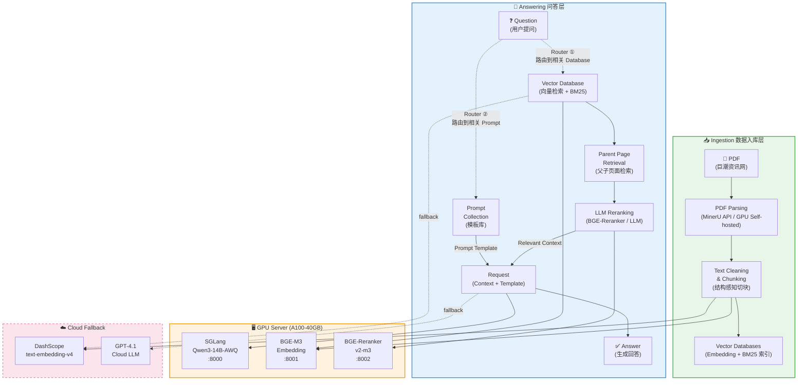
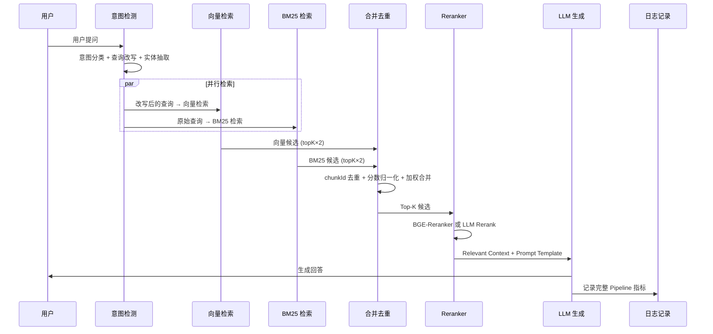

# FinSpark RAG 财报智能问答系统 — 需求与设计文档

> **版本**: v1.0  
> **日期**: 2026-04-03  
> **项目**: FinSpark Investment Analysis Platform  
> **代码规模**: ~10,171 行 TypeScript（14 个 RAG 服务模块 + 4 个路由模块）  
> **状态**: 核心流水线已验证通过

---

## 目录

- [第一章 · 总体架构概览](#第一章--总体架构概览)
- [第二章 · 向量数据库选型](#第二章--向量数据库选型建议与决策)
- [第三章 · Embedding 模型选型与决策](#第三章--embedding-模型选型与决策)
- [第四章 · 文档解析工具选型](#第四章--文档解析工具选型)
- [第五章 · Prompt 模板库设计](#第五章--prompt-模板库设计)
- [第六章 · 元数据体系与父子页面检索策略](#第六章--元数据体系与父子页面检索策略)
- [第七章 · 检索与生成流水线](#第七章--检索与生成流水线rag-pipeline)
- [第八章 · GPU 部署与路由架构](#第八章--gpu-部署与路由架构)
- [第九章 · 数据自动同步](#第九章--数据自动同步autosync)
- [第十章 · 质量保障体系](#第十章--质量保障体系)
- [第十一章 · 版本管理与运维](#第十一章--版本管理与运维)
- [第十二章 · 演进路线图与优先级](#第十二章--演进路线图与优先级)
- [附录](#附录)

---

## 第一章 · 总体架构概览

### 1.1 总体架构图

> **注**: 以下为 Mermaid 源码，可粘贴至 [mermaid.live](https://mermaid.live) 或任意支持 Mermaid 的工具中渲染。若当前环境无法渲染，请使用上述工具生成流程图。



### 1.2 架构设计核心创新

本系统在 naive RAG 基础上引入三个关键增强模块：

| 增强模块 | 作用 | 实现位置 |
|---|---|---|
| **Router ① — Database 路由器** | 根据股票代码/报告类型将查询路由到相关向量库子集，缩小检索范围 | `ragPipeline.ts` 元数据预过滤 |
| **Router ② — Prompt 路由器** | 根据意图分类（6类）选择最合适的 Prompt 模板，提升生成质量 | `ragIntent.ts` → `ragConfig.ts` |
| **LLM Reranking** | 对初检结果进行语义重排序，显著提升 Top-K 精准度 | `ragPipeline.ts` BGE-Reranker / LLM |

### 1.3 技术栈总览

| 层级 | 技术选型 | 说明 |
|---|---|---|
| **运行时** | Cloudflare Workers (Hono) | 边缘计算，全球低延迟 |
| **关系存储** | Cloudflare D1 (SQLite) | 14 张 RAG 相关表 |
| **向量存储** | Cloudflare KV | 键 `rag:emb:{docId}:{chunkIdx}` |
| **PDF 解析** | MinerU API v4 / GPU Self-hosted | OCR + 表格 + 公式提取 |
| **Embedding** | DashScope v4 (Cloud) / BGE-M3 (GPU) | 1024-dim 双轨 |
| **LLM** | Qwen3-14B-AWQ (GPU) / GPT-4.1 (Cloud) | SGLang 推理引擎 |
| **Reranker** | BGE-Reranker-v2-m3 (GPU) | 交叉编码器，<50ms |
| **BM25** | 自研 `ragBm25.ts` | Intl.Segmenter 中文分词 |
| **前端** | Hono SSR | 18 个 RAG 管理页面 |

### 1.4 系统边界与约束条件

| 约束 | 影响 | 应对策略 |
|---|---|---|
| Workers CPU 限时 30-50s | 大文档 embedding 可能超时 | `waitUntil()` + D1 批量写入 |
| KV 无 ANN 索引 | 只能暴力遍历余弦相似度 | <50k chunks 可接受 (~200ms) |
| D1 单写者 | 并发写入可能冲突 | `db.batch()` 合并写操作 |
| KV 单值 25MB 限制 | 向量以 JSON float[] 存储 | 每 chunk 一个 KV key |
| GPU 服务器在国内 | 与边缘 Worker RTT ~500ms | SSH 隧道 + Nginx 代理 + 自动降级 |
| MinerU 解析 5-15min | 大文档需异步轮询 | 后台轮询 + 15min 超时 + 状态机 |

---

## 第二章 · 向量数据库选型（建议与决策）

### 2.1 当前方案：Cloudflare KV + 暴力余弦检索

**架构细节**：
- 向量存储键格式：`rag:emb:{documentId}:{chunkIndex}`
- 向量格式：JSON `float[1024]`（1024 维浮点数组）
- 检索方式：加载全部候选向量 → 逐一计算余弦相似度 → 排序取 Top-K
- 实测性能：~3,000 chunks 时检索耗时约 200ms，可接受

**选择此方案的原因**：
1. Cloudflare Workers 生态原生支持 KV，零额外依赖
2. 早期阶段数据量小（<10k chunks），暴力检索足够
3. 避免引入外部向量数据库带来的网络延迟和运维成本

### 2.2 候选数据库完整对比矩阵

| 数据库 | 类型 | 开源 | ANN 算法 | 混合检索 | 动态更新 | 部署方式 | 适用规模 |
|---|---|---|---|---|---|---|---|
| **FAISS** | 库 (Library) | ✅ | IVF / HNSW / PQ | ❌ | ❌ (静态优先) | 嵌入应用 | 百万~十亿级离线 |
| **Elasticsearch** | 搜索引擎 | ✅ | k-NN (HNSW) | ✅ **业界领先** | ✅ | 自部署 / 弹性云 | 万~亿级 |
| **Milvus** | 向量数据库 | ✅ | IVF / HNSW / DiskANN | ✅ | ✅ 分布式 | 自部署 / Zilliz Cloud | 十万~百亿级 |
| **Pinecone** | 向量数据库 | ❌ | 专有 | ✅ | ✅ | **全托管云** | 万~亿级 |
| **Qdrant** | 向量数据库 | ✅ | HNSW | ✅ | ✅ | 自部署 / Cloud | 万~亿级 |
| **Weaviate** | 向量数据库 | ✅ | HNSW | ✅ | ✅ | 自部署 / Cloud | 万~亿级 |
| **Cloudflare Vectorize** | 向量数据库 | ❌ | 专有 | ❌ | ✅ | **全托管** (Workers 原生) | 万~百万级 |
| **Chroma** | 向量数据库 | ✅ | HNSW | ❌ | ✅ | 嵌入/自部署 | 千~十万级 (POC) |

### 2.3 各候选详细评估

#### 2.3.1 FAISS (Facebook AI Similarity Search)

- **特点**：由 Facebook/Meta 开发，专注于高性能的相似性搜索，适合大规模静态数据集
- **优势**：检索速度快，支持多种索引类型（IVF-Flat、IVF-PQ、HNSW），GPU 加速支持良好
- **局限性**：主要用于静态数据，更新和删除操作较复杂；作为库而非服务，需要自行管理持久化
- **适用场景**：离线批量构建索引后提供在线查询服务，数据不频繁变更的场景

#### 2.3.2 Elasticsearch

- **特点**：强大的分布式搜索和分析引擎，将向量搜索（k-NN）作为其众多功能之一
- **优势**：**具备业界领先的混合搜索能力**，可以无缝结合传统的关键词搜索和向量语义搜索；生态成熟，运维工具丰富
- **局限性**：资源消耗较大（JVM 内存），纯向量检索性能不如专用向量数据库
- **适用场景**：需要同时支持全文搜索和向量检索的混合场景，已有 ES 基础设施的团队

#### 2.3.3 Milvus

- **特点**：开源，支持分布式架构和动态数据更新，GitHub 35k+ stars
- **优势**：具备强大的扩展性和灵活的数据管理功能；支持多种索引类型和数据类型；Zilliz Cloud 提供全托管服务
- **局限性**：分布式部署运维成本较高；单机模式功能受限
- **适用场景**：大规模生产环境，需要水平扩展的企业级应用

#### 2.3.4 Pinecone

- **特点**：托管的云原生向量数据库，支持高性能的向量搜索
- **优势**：**完全托管，易于部署**，适合大规模生产环境；零运维负担，开发者体验好
- **局限性**：闭源，数据存储在第三方；成本随规模线性增长；国内访问可能有延迟
- **适用场景**：快速上线的 SaaS 产品，不想自建基础设施的团队

#### 2.3.5 Qdrant

- **特点**：Rust 实现的高性能向量数据库，GitHub 22k+ stars
- **优势**：内存效率高，支持丰富的过滤条件；单机性能优异
- **局限性**：分布式功能相比 Milvus 较新
- **适用场景**：高性能自托管方案，对延迟要求严格的场景

#### 2.3.6 Weaviate

- **特点**：Go 实现的向量数据库，支持 GraphQL 查询
- **优势**：多模态支持好，内置向量化模块；GraphQL 接口灵活
- **局限性**：资源消耗较 Qdrant 更大
- **适用场景**：需要多模态检索和灵活查询的场景

#### 2.3.7 Cloudflare Vectorize

- **特点**：Cloudflare 生态原生向量数据库，与 Workers 深度集成
- **优势**：零额外网络延迟（同一数据中心），配置简单，按用量计费
- **局限性**：功能较新，不支持混合检索，索引类型有限
- **适用场景**：已使用 Cloudflare Workers 的项目，数据量中等

#### 2.3.8 Chroma

- **特点**：轻量级嵌入式向量数据库，Python/JS SDK
- **优势**：启动快速，适合原型验证，学习成本低
- **局限性**：不适合大规模生产；持久化和分布式支持有限
- **适用场景**：POC / 原型开发，本地测试

### 2.4 分阶段演进建议

```
Phase 1 (当前 ≤50k chunks)     Phase 2 (50k–500k)              Phase 3 (>500k)
┌─────────────────────┐     ┌────────────────────────┐     ┌──────────────────────┐
│  Cloudflare KV      │     │  Cloudflare Vectorize  │     │  Milvus / Qdrant     │
│  + 暴力余弦检索     │ ──► │  或 Elasticsearch      │ ──► │  分布式集群          │
│  ~200ms / 3k chunks │     │  ANN + 混合检索        │     │  ANN + 混合 + 过滤   │
└─────────────────────┘     └────────────────────────┘     └──────────────────────┘
  ✅ 零依赖，零成本            中等运维，性能提升 10x+          企业级，水平扩展
```

| 阶段 | 时间 | 数据规模 | 推荐方案 | 决策理由 |
|---|---|---|---|---|
| **Phase 1** | 当前 | ≤50k chunks | Cloudflare KV | 零额外成本，当前性能可接受 |
| **Phase 2** | 中期 1-2月 | 50k-500k | **Cloudflare Vectorize** (首选) 或 **Elasticsearch** | Vectorize 与 Workers 原生集成；ES 适合需要混合检索的场景 |
| **Phase 3** | 长期 3-6月 | >500k | **Milvus** (Zilliz Cloud) 或 **Qdrant** | 水平扩展能力强，支持亿级向量 |

### 2.5 推荐决策 Trade-off 分析

**结合 FinSpark 实际场景的推荐**：

1. **短期维持 KV**：当前已入库文档 <10 个，chunks <5k，暴力检索完全可行
2. **中期首选 Cloudflare Vectorize**：
   - ✅ 与 Workers 零延迟集成（同一边缘节点）
   - ✅ 无需额外运维，按用量付费
   - ✅ 支持标准 ANN 检索
   - ⚠️ 不支持混合检索（BM25 仍需独立维护）
3. **若需混合检索，考虑 Elasticsearch**：
   - ✅ 关键词 + 向量一站式解决
   - ⚠️ 需要额外部署和运维
4. **不建议 Pinecone**：国内访问延迟大，闭源数据安全风险
5. **不建议 FAISS**：适合静态数据，FinSpark 需要频繁更新

---

## 第三章 · Embedding 模型选型与决策

### 3.1 选型方法论：不能仅依靠 MTEB

> 模型选型是一个系统的过程，不能仅依赖于公开榜单。

#### 3.1.1 明确业务场景与评估指标

FinSpark 的核心任务是**中文金融文档检索 (Retrieval)**，业务成功的关键指标：

| 指标 | 定义 | 目标 |
|---|---|---|
| **Recall@K** | Top-K 检索结果中包含正确答案的比例 | ≥0.85 @K=10 |
| **NDCG@10** | 归一化折损累计增益，衡量排序质量 | ≥0.70 |
| **Accuracy** | 最终回答的准确率 | ≥0.80 |
| **Latency** | 单次检索延迟 | <500ms |

#### 3.1.2 构建"黄金"测试集

> **这是选型中最关键的一步**。准备一套能真实反映业务场景和数据分布的高质量小规模测试集。

**构建方法**：
1. 从已入库财报中人工标注 100-200 个"问题-标准答案"对
2. 覆盖六种意图类型：数值查询、名称查询、布尔判断、比较分析、开放问题、字符串检索
3. 包含不同难度：简单事实查询 / 跨段落推理 / 跨报告对比
4. 确保覆盖典型金融术语：营业收入、净利润、毛利率、ROE、EPS 等

**评估方法**：
- 对每个候选模型，用黄金测试集计算 Recall@K 和 NDCG
- 这是评估模型好坏的**"金标准"**

#### 3.1.3 小范围对比测试 (Benchmark)

从 MTEB / C-MTEB 榜单中挑选排名靠前且符合需求（语言、维度）的候选模型，使用"黄金"测试集进行实测评测。

#### 3.1.4 综合评估决策公式

> **Embedding 模型的选择属于综合评估，即结合测试结果、模型的推理速度、部署成本 ⇒ 做出最终决策。**

```
最终评分 = 0.5 × 黄金测试集得分 + 0.2 × 推理速度得分 + 0.2 × 部署成本得分 + 0.1 × 生态成熟度
```

### 3.2 向量维度对性能的影响

> **核心认知**：向量维度直接影响模型的表达能力、计算开销和内存占用。

**高维度 (1024, 4096)**：编码更丰富、语义更细致，适用于需要深度语义理解的复杂场景，如大规模、多样化的信息检索，或者细粒度的文本分类。但计算成本更高，所需存储空间更大。

**低维度 (256, 512)**：计算速度快，内存占用小，更适合计算资源有限，或实时性要求高的场景，比如移动端。

**关键 Thinking — 性价比分析**：

| 场景 | 维度变化 | 检索指标变化 | 内存变化 | 决策 |
|---|---|---|---|---|
| 768 → 1024 | +33% | **提高不到 1%** | **多占约 35%** | ❌ **不需要，性价比低** |
| 1024 → 768 | -25% | **下降超过 5%** | -25% | ❌ **不可接受，信息损失大** |
| 3072 → 256 (MRL) | -92% | **下降 <1%** (Voyage/Jina) | **节省 12x** | ✅ 若模型支持 MRL |

**结论**：FinSpark 选择 **1024 维**是当前最优平衡点——既保证了金融语义的细粒度区分，又不会因维度过高导致存储和计算成本爆炸。

### 3.3 单语言 vs 多语言模型选择

#### 单语言模型（中文专精）

**BGE-large-zh** (326M params, 768-dim)
- 专门针对中文语料训练，C-MTEB 中文任务表现优秀
- 适合纯中文财报场景，推理速度快
- 局限：不支持英文/多语言查询，维度 768 偏低

#### 多语言模型

**Qwen-3-Embedding** (0.6B / 4B / 8B params)
- 基于 Qwen3 语言模型架构，支持 80+ 语言
- **MTEB English 比 BGE-M3 高 18.7%**，CMTEB 中文高 9.9%，MMTEB 多语言高 8.0%
- 训练数据量最大，合成数据 + 硬负例挖掘
- 0.6B 版本：1024-dim，与 BGE-M3 同参数量但精度大幅领先

**BGE-M3** (568M params, 1024-dim)
- BAAI 出品，100+ 语言支持
- **独特优势**：同时支持 Dense + Sparse + Multi-vector 三种检索方式
- 支持 8192 token 长上下文（财报长段落友好）
- ONNX 量化成熟（3x 加速，精度损失 <1%）
- 部署灵活性最佳

**multilingual-e5-large** (560M params, 1024-dim)
- Microsoft 出品，100+ 语言稳定基线
- 训练数据量相对较少
- 适合作为对比基线

### 3.4 候选模型完整对比矩阵

| 模型 | 参数量 | 维度 | 中文 Retrieval | 多语言 | 长上下文 | 混合检索 | 部署成本 | MTEB 总分 |
|---|---|---|---|---|---|---|---|---|
| **BGE-large-zh** | 326M | 768 | ⭐⭐⭐⭐⭐ | ❌ 仅中文 | 512 tok | ❌ | 🟢 低 | — (C-MTEB 专) |
| **BGE-M3** | 568M | 1024 | ⭐⭐⭐⭐ | ✅ 100+ | **8192 tok** | ✅ D+S+MV | 🟡 中 | 63.0 |
| **Qwen-3-Embedding-0.6B** | 600M | 1024 | ⭐⭐⭐⭐⭐ | ✅ 80+ | 4096 tok | ❌ | 🟡 中 | **70.7** |
| **Qwen-3-Embedding-4B** | 4B | 2560 | ⭐⭐⭐⭐⭐ | ✅ 80+ | 4096 tok | ❌ | 🔴 高 | 74.6 |
| **Qwen-3-Embedding-8B** | 8B | 4096 | ⭐⭐⭐⭐⭐ | ✅ 80+ | 4096 tok | ❌ | 🔴 很高 | **75.2** |
| **multilingual-e5-large** | 560M | 1024 | ⭐⭐⭐ | ✅ 100+ | 512 tok | ❌ | 🟡 中 | — |
| **DashScope v4** | 未公开 | 1024 | ⭐⭐⭐⭐ | ✅ | API 调用 | ❌ | 💰 按量计费 | — |
| **OpenAI 3-small** | 未公开 | 1536 | ⭐⭐⭐ | ✅ | 8191 tok | ❌ | 💰 按量计费 | 64.6 |
| **Cohere embed-v4** | 未公开 | 固定 | ⭐⭐⭐ | ✅ | API 调用 | ❌ | 💰 按量计费 | 65.2 |

**Benchmark 数据来源**：Qwen-3 技术报告 (2025.11)、MTEB Leaderboard、Milvus CCKM Benchmark (2026.03)

### 3.5 当前双轨方案与推荐演进

#### 当前方案

```
┌─────────────────────────────────────────────────┐
│              FinSpark Embedding 双轨             │
│                                                  │
│  Cloud 路径 ─── DashScope text-embedding-v4      │
│       │         1024-dim, batch=10               │
│       │         按调用量计费                      │
│       │                                          │
│  GPU 路径 ──── BGE-M3 (port 8001)                │
│                1024-dim, self-hosted              │
│                Dense + Sparse + Multi-vector      │
│                                                  │
│  维度统一: 1024-dim (两条路径一致)                 │
└─────────────────────────────────────────────────┘
```

#### 推荐演进路线

| 阶段 | 时间 | 方案 | 理由 |
|---|---|---|---|
| **短期** | 当前 | DashScope v4 (Cloud) + BGE-M3 (GPU) | 双轨互备，稳定运行 |
| **中期** | 1-2月 | **全量迁移 Qwen-3-Embedding-0.6B** 自托管 | MTEB 精度比 BGE-M3 高 18.7%，同参数量 |
| **长期** | 3-6月 | 评估 Qwen-3-4B 或多模态模型 | 若需处理图表/扫描件 |

#### 模型切换注意事项

> ⚠️ **切换 Embedding 模型需要重建全部向量**。不同模型生成的向量空间不兼容。

重建步骤：
1. 新模型部署并验证
2. 批量重新生成所有 chunk 的 embedding
3. 写入新的 KV 键空间（`rag:emb:v2:{docId}:{chunkIdx}`）
4. 切换检索指向新键空间
5. 清理旧向量数据

### 3.6 维度统一策略

当前系统统一使用 **1024 维**，这是经过以下考量确定的：

1. **BGE-M3 默认 1024-dim**，与 DashScope v4 一致
2. **Qwen-3-0.6B 也是 1024-dim**，未来迁移无需调整存储
3. **1024 → 768 压缩后指标下降 >5%**，不可接受
4. **1024 → 2560/4096 提升有限**，存储成本大幅增加
5. **存储预算**：1024-dim × float32 × 50k chunks ≈ 200MB KV 存储，可控

---

## 第四章 · 文档解析工具选型

### 4.1 业务需求分析

FinSpark 的 PDF 解析需求有以下特点：

| 需求维度 | 具体要求 |
|---|---|
| **数据量** | A 股上市公司约 5,000 家，每家每年 4 份定期报告（年报/半年报/季报），**预计总量 2 万+ PDF/年** |
| **文件大小** | 年报通常 200-500 页 (3-50MB)，季报 20-50 页 |
| **内容类型** | 文字 + 表格（财务报表）+ 公式 + 图表 |
| **中文支持** | 必须，且需处理中英混排 |
| **表格精度** | 关键——财务报表的数字精度直接影响回答质量 |
| **批量处理** | 需要支持批量自动化处理 |
| **更新频率** | 季度集中更新（财报季），日常零星公告 |

### 4.2 部署方式决策：API vs GPU 自托管

> **结论：选择 GPU 自托管方案。** 核心决策因素是数据量大 + 需要批量处理。

#### 成本对比分析

**场景假设**：每年处理 20,000 份 PDF，平均 100 页/份，合计 **200 万页/年**

| 方案 | 单价 | 年成本 (200 万页) | 延迟 | 数据安全 | 可控性 |
|---|---|---|---|---|---|
| **LlamaParse API** | ~$0.045/页 (1000 credits=$1.25, ~28 credits/页) | **~$90,000/年** | 低 (6s/文档) | ⚠️ 数据上传至第三方 | 低 |
| **MinerU API** (在线) | 免费额度 + 超出按量 | 免费额度有限，大规模需商议 | 中 (5-15min/文档) | ⚠️ 数据经 API | 中 |
| **Unstructured API** | ~$0.01/页 | **~$20,000/年** | 高 (51-141s/文档) | ⚠️ 数据上传至第三方 | 低 |
| **MinerU GPU 自托管** | GPU 租赁 ~¥3,000/月 | **~¥36,000/年 (~$5,000)** | 可控 | ✅ 数据不出服务器 | **高** |
| **Marker GPU 自托管** | GPU 租赁 ~¥3,000/月 | **~¥36,000/年 (~$5,000)** | 快 | ✅ 数据不出服务器 | 高 |

#### GPU 自托管方案优势

1. **成本优势**：年处理 200 万页仅需 ~$5,000（GPU 租赁），API 方案动辄数万美元
2. **边际成本递减**：处理量越大，单页成本越低；API 方案线性增长
3. **批量处理能力**：可 24/7 连续运行，充分利用 GPU 资源
4. **数据安全**：财务数据不离开自有服务器，满足合规要求
5. **可定制**：可针对中文财报优化模型参数和预/后处理流程
6. **与现有 GPU 共用**：已有 A100-40GB 部署 LLM/Embedding/Reranker，可共享资源

#### 成本拐点分析

```
成本 ($)
  │
  │  ╱ LlamaParse API ($90k/年)
  │ ╱
  │╱        ╱ Unstructured API ($20k/年)
  │        ╱
  │───────╱──────────── GPU 自托管 ($5k/年，固定成本)
  │      ╱
  │─────╱───── MinerU API (免费额度)
  │    ╱
  └────┼──────┼──────┼──────► 页数/年
       10k   100k   1M   2M

  拐点：~50,000 页/年时，GPU 自托管开始优于付费 API
```

### 4.3 候选解析工具对比矩阵

#### 基于最新 Benchmark (arXiv:2603.18652, 2026.03)

该 Benchmark 对 21 个 PDF 解析器在 451 个表格上进行了 LLM 语义评分（0-10 分）：

| 解析器 | 评分 (0-10) | 中文 OCR | 表格还原 | 公式支持 | 推理成本/时间 | 开源 | 适用方式 |
|---|---|---|---|---|---|---|---|
| **Gemini 3 Flash** | **9.50** | ✅ | ✅ 优秀 | ✅ | $0.57 / 100页 API | ❌ | API |
| **MinerU 2.5** | 6.49 | ✅ 优秀 | ✅ HTML+MD | ✅ LaTeX | GPU 自托管 / API | **✅** | **API + Self-host** |
| **LlamaParse** | — (未参评) | ✅ | ✅ 优秀 | ✅ | $0.045/页 API | ❌ | API |
| **Marker** | — (未参评) | ✅ | ✅ | ✅ | GPU 自托管 | ✅ | Self-host |
| **Docling (IBM)** | — (未参评) | ✅ | ✅ | ✅ | CPU/GPU 自托管 | ✅ | Self-host |
| **Unstructured.io** | — (未参评) | ✅ | ✅ | ⚠️ 有限 | $0.01/页 API | ✅ | API + Self-host |
| **PyMuPDF4LLM** | 5.25 | ✅ 基础 | ⚠️ 有限 | ❌ | CPU 30s / 100页 | ✅ | 本地库 |
| **Mistral OCR 3** | **8.89** | ✅ | ✅ | ✅ | $0.20 / 100页 API | ❌ | API |
| **dots.ocr** | 8.73 | ✅ | ✅ | ✅ | GPU 20min / 100页 | 未知 | GPU |
| **MonkeyOCR-3B** | 8.39 | ✅ | ✅ | ✅ | GPU 20min / 100页 | ✅ | GPU |

> *评分来源: "Benchmarking PDF Parsers on Table Extraction with LLM-based Semantic Evaluation" (arXiv:2603.18652, 2026.03)*

### 4.4 当前方案：MinerU API + GPU Self-hosted

#### 选择 MinerU 的理由

1. **完全开源** (Apache-2.0)：可自由部署，无 License 限制
2. **中文支持优秀**：专门针对中文文档优化 OCR 和版面分析
3. **多功能**：同时支持 OCR、表格提取 (HTML)、公式提取 (LaTeX)
4. **双部署模式**：API 快速验证 + GPU 自托管降低成本
5. **活跃社区**：GitHub 高活跃度，持续迭代

#### 工作流程

```
CNInfo PDF URL
    │
    ▼
MinerU API (v4 Precise Parse)
    │  ┌─ OCR 识别
    │  ├─ 表格提取 (→ HTML)
    │  ├─ 公式提取 (→ LaTeX)
    │  └─ 版面分析 (→ 阅读序)
    ▼
Task Polling (3s 间隔, 15min 超时)
    │
    ▼
ZIP 下载 (CDN)
    │
    ▼
fflate 解压 (DEFLATE 支持)
    │
    ▼
full.md (Markdown + HTML 表格)
    │
    ▼
cleanMinerUMarkdown() — 清洗标注噪声
    │
    ▼
extractStructuredBlocks() — 提取结构化块
    │  ┌─ heading 块 (标题)
    │  ├─ text 块 (正文)
    │  └─ table 块 (HTML 表格 + Caption)
    ▼
结构感知切块 → Embedding → 入库
```

#### MinerU 部署要求 (GPU Self-hosted)

| 配置项 | 最低要求 | 推荐配置 |
|---|---|---|
| GPU | Volta 架构+ (V100/A100/RTX 30xx+) | A100-40GB |
| VRAM | 4GB (pipeline 后端) / 8GB (VLM 后端) | 8GB+ |
| 内存 | 16GB+ | 32GB+ |
| 磁盘 | 20GB+ SSD | 50GB+ SSD |
| Python | 3.10-3.13 | 3.11 |
| 精度 (OmniDocBench) | 86+ (pipeline) | 90+ (VLM) |

### 4.5 HTML 解析（非 PDF 场景）

部分巨潮公告以 HTML 格式提供，当前使用 `ragCninfo.ts` 中的自研解析逻辑处理：
- 提取正文内容，去除导航/页脚噪声
- 保留表格结构
- 标准化为 Markdown 格式后走统一切块流程

### 4.6 已知问题与改进计划

| 问题 | 现状 | 改进方向 |
|---|---|---|
| 大文件解析超时 | 已调至 15min，444 页年报可完成 | GPU 自托管可进一步加速 |
| 表格数据精度 | MinerU 评分 6.49/10（中等） | 结合 Gemini Flash 做二次校验 |
| 扫描件/图片 PDF | OCR 可处理但精度有下降 | VLM 后端 (90+ 精度) |
| 图表理解 | 当前不支持提取图表中的数据 | 引入多模态 VLM 解析 |
| 公式渲染 | 提取 LaTeX 但未做语义理解 | 结合 LLM 翻译公式含义 |

---

## 第五章 · Prompt 模板库设计

### 5.1 模板库架构

#### 数据模型

```sql
-- 模板表
CREATE TABLE rag_prompt_templates (
    id              INTEGER PRIMARY KEY,
    template_key    TEXT UNIQUE NOT NULL,      -- 唯一标识 (如 'intent_detection')
    display_name    TEXT NOT NULL,              -- 展示名称
    description     TEXT,                       -- 用途说明
    usage_context   TEXT,                       -- 使用上下文
    variables       TEXT NOT NULL DEFAULT '[]', -- JSON: 支持的变量列表
    current_version_id INTEGER,                -- 当前使用的版本 ID
    is_active       INTEGER DEFAULT 1,
    created_at      TEXT DEFAULT (datetime('now')),
    updated_at      TEXT DEFAULT (datetime('now'))
);

-- 版本表 (每次修改自动创建新版本)
CREATE TABLE rag_prompt_versions (
    id              INTEGER PRIMARY KEY,
    template_id     INTEGER NOT NULL,
    version_label   TEXT NOT NULL,             -- 如 'v1.0', 'v1.1'
    content         TEXT NOT NULL,             -- Prompt 正文
    change_note     TEXT,                      -- 变更说明
    created_by      TEXT,
    created_at      TEXT DEFAULT (datetime('now')),
    FOREIGN KEY (template_id) REFERENCES rag_prompt_templates(id)
);
```

#### 管理界面

通过 `/rag/settings/prompts` 页面提供可视化管理：
- 模板列表与搜索
- 在线编辑与实时预览
- 版本历史与 Diff 对比
- 一键回退到历史版本

### 5.2 核心 Prompt 模板清单

| # | template_key | 用途 | 输入变量 | 输出格式 |
|---|---|---|---|---|
| 1 | `intent_detection` | 意图分类(6类) + 查询改写 + 实体抽取 + 子查询拆分 | `{{query}}` | JSON |
| 2 | `answer_generation` | 基于检索 Context 生成结构化回答 | `{{context}}`, `{{query}}`, `{{intent_hints}}` | Markdown |
| 3 | `hyde_generation` | HyDE 假设性文档生成，提升检索召回率 | `{{query}}` | Text |
| 4 | `entity_tagging` | 自动标注实体（公司名、指标名、时间等） | `{{chunk_content}}` | JSON |
| 5 | `summary_enrichment` | 为 Chunk 生成摘要，增加语义信息 | `{{chunk_content}}`, `{{document_title}}` | JSON |
| 6 | `knowledge_extraction` | 从对话中提取结构化知识 | `{{conversation}}` | JSON |
| 7 | `rerank_prompt` | LLM 重排序（当 GPU Reranker 不可用时） | `{{query}}`, `{{candidates}}` | JSON |

### 5.3 版本管理机制

```
Template: intent_detection
  │
  ├── v1.0 (初始版本) ─── 2026-03-20
  │     └── 基础意图分类，4种类型
  │
  ├── v1.1 (优化版) ─── 2026-03-25
  │     └── 扩展到6种意图类型，增加子查询拆分
  │
  ├── v2.0 (A/B 测试) ─── 2026-04-01
  │     └── 增加 few-shot examples
  │
  └── v2.1 (当前使用) ◄── current_version_id
        └── 调整 temperature 0.1，增加 confidence 输出
```

- **自动版本快照**：每次修改自动创建新版本，保留完整历史
- **一键回退**：`revertPromptVersion(key, versionId)` 即时回退
- **A/B 测试支持**：`ModelRouting.answerGeneration.abTest` 可同时运行两个版本

### 5.4 变量注入规范

| 变量名 | 类型 | 说明 | 示例 |
|---|---|---|---|
| `{{query}}` | string | 用户原始问题 | "贵州茅台2024年净利润是多少？" |
| `{{rewritten_query}}` | string | 改写后的查询 | "贵州茅台(600519) 2024年度 净利润 归母净利润" |
| `{{context}}` | string | 检索到的相关片段 | "【来源1: 贵州茅台 2024年年报 P.85】..." |
| `{{entities}}` | JSON | 抽取的实体 | `{"company":"贵州茅台","metric":"净利润","year":"2024"}` |
| `{{intent_type}}` | string | 意图分类结果 | "number" |
| `{{intent_hints}}` | string | 意图提示信息 | "这是一个数值查询，需要给出精确数字" |
| `{{sub_queries}}` | string[] | 拆分的子查询 | 比较类问题拆分为多个子问题 |

### 5.5 Prompt 路由器设计 (Router ②)

Router ② 根据意图分类结果选择最合适的 Prompt 模板：

```
用户问题
    │
    ▼
意图检测 (ragIntent.ts)
    │
    ├── number (数值) ───► answer_generation_numeric
    │                        (强调精确数字 + 来源页码)
    │
    ├── comparative ────► answer_generation_compare
    │                        (对比表格格式 + 多来源)
    │
    ├── boolean ────────► answer_generation_boolean
    │                        (是/否 + 依据引用)
    │
    ├── name ───────────► answer_generation_name
    │                        (实体列举 + 完整性)
    │
    ├── open ───────────► answer_generation_open
    │                        (综合分析 + 多角度)
    │
    └── string ─────────► answer_generation_default
                            (通用回答模板)
```

---

## 第六章 · 元数据体系与父子页面检索策略

### 6.1 元数据字段定义

#### 文档级元数据 (rag_documents 表)

| 字段 | 类型 | 说明 | 示例 |
|---|---|---|---|
| `stock_code` | TEXT | 股票代码 | "600519" |
| `stock_name` | TEXT | 股票名称 | "贵州茅台" |
| `category` | TEXT | 报告类别 | "annual_report" / "q1_report" |
| `tags` | JSON | 标签数组 | `["annual","2024","600519"]` |
| `embedding_model` | TEXT | 使用的 Embedding 模型 | "dashscope/text-embedding-v4" |
| `file_type` | TEXT | 文件类型 | "pdf" / "text" / "html" |
| `file_size` | INTEGER | 文件大小 (bytes) | 540756 |

#### Chunk 级元数据 (rag_chunks.metadata JSON)

| 字段 | 类型 | 说明 | 示例 |
|---|---|---|---|
| `heading` | string | 所属章节标题 | "第三节 管理层讨论与分析" |
| `headingLevel` | number | 标题层级 (1-6) | 2 |
| `chunkType` | string | 块类型 | "text" / "table" / "heading" |
| `pageStart` | number | 起始页码 | 85 |
| `pageEnd` | number | 结束页码 | 87 |
| `positionRatio` | number | 在文档中的位置比例 | 0.42 (42% 位置) |
| `sourceFile` | string | 来源文件名 | "600519_2024_annual.pdf" |
| `stockCode` | string | 冗余的股票代码 | "600519" |
| `category` | string | 冗余的报告类别 | "annual_report" |
| `tableCaption` | string | 表格标题 (仅 table 类型) | "表1：主要财务指标" |
| `tableIndex` | number | 表格序号 (文档内) | 3 |

### 6.2 结构感知切块 (Structure-aware Chunking)

#### 切块流程

```
MinerU Markdown 输出
    │
    ▼
extractStructuredBlocks(markdown)
    │  解析 <!-- page: N --> 注释追踪页码
    │  识别 # 标题行 → heading 块
    │  识别 | 开头连续行 → table 块 (→ HTML)
    │  其余内容 → text 块
    │  每个块携带 page/heading 上下文
    ▼
StructuredBlock[] (heading / text / table)
    │
    ▼
splitChunksFromBlocks(blocks)
    │  heading 块：与后续 text 合并（不单独成块）
    │  text 块：递归字符分割 (size=1500, overlap=200)
    │  table 块：独立保留（含 HTML + rawMarkdown + Caption）
    │  所有 chunk 继承父级 heading 和 page 信息
    ▼
ChunkWithMetadata[] → Embedding → 入库
```

#### 三类结构块

| 类型 | 识别规则 | 处理方式 | 元数据 |
|---|---|---|---|
| **heading** | `#` / `##` / `###` 开头 | 作为后续 text 块的 heading 属性，不单独切片 | headingLevel |
| **text** | 非标题非表格的内容 | 递归字符分割 (1500/200) | heading, pageStart, pageEnd |
| **table** | 连续 `\|` 开头的行 | **独立保留**，转换为 HTML，附带 Caption | tableCaption, tableIndex |

### 6.3 Parent Page Retrieval 策略

> 这是架构图中从 Vector Database 到 LLM Reranking 之间的关键环节。

#### 当前实现

```
检索到的 Chunk
    │
    ├── chunk.metadata.heading → 作为"父级上下文"
    │     例: "第三节 管理层讨论与分析 > 一、报告期内主要经营情况"
    │
    ├── chunk.metadata.pageStart / pageEnd → 页码定位
    │     例: "P.85-87"
    │
    └── 构建 Context 时包含父级信息：
          "【来源1: 贵州茅台 2024年年报 P.85 [第三节 管理层讨论与分析]】
           报告期内，公司实现营业总收入..."
```

#### 检索时上下文扩展

```typescript
// 当前实现 (rag.ts → searchSimilar)
const headingInfo = meta.heading ? ` [${meta.heading}]` : '';
context += `【来源${index + 1}: ${item.documentTitle}${pageInfo}${headingInfo}】\n${item.chunk.content}\n\n`;
```

#### 计划增强：显式父子关系

```
Phase 2 目标:
┌─────────────────────────────────────┐
│  parent_chunk (大段落, size=3000)    │
│  ├── child_chunk_1 (size=1500)      │ ← 检索命中
│  ├── child_chunk_2 (size=1500)      │
│  └── child_chunk_3 (size=1500)      │
└─────────────────────────────────────┘

检索 child_chunk_1 时，同时返回 parent_chunk 作为扩展上下文
→ 提供更完整的信息，避免切块边界导致的信息丢失
```

实现方案：
1. 新增 `parent_chunk_id` 字段指向父级 chunk
2. 检索时自动加载 parent chunk 内容
3. 上下文窗口：命中 chunk ± 相邻 1-2 个 chunks

### 6.4 混合检索融合 (Vector + BM25)

```
用户查询
    │
    ├─► 向量检索 (cosine similarity)
    │   topK × 2 候选
    │
    ├─► BM25 检索 (关键词匹配)
    │   topK × 2 候选
    │
    ▼
mergeAndDedup()
    │
    ├── 按 chunkId 去重
    ├── BM25 分数归一化 (min-max → 0~1)
    ├── 向量分数已在 0~1 范围
    ├── 加权合并: finalScore = α × vectorScore + β × bm25Score
    │   (α=0.7, β=0.3 默认权重)
    ▼
排序后 Top-K 候选 → Reranking
```

### 6.5 元数据预过滤 (Database Router ①)

```
用户: "贵州茅台2024年净利润是多少？"
    │
    ▼
意图检测 → 提取实体:
    stock_code: "600519"
    year: "2024"
    metric: "净利润"
    │
    ▼
元数据过滤 (Router ①):
    WHERE stock_code = '600519'
    AND category IN ('annual_report', 'q1_report', ...)
    AND tags LIKE '%2024%'
    │
    ▼
缩小检索范围: 全部 50k chunks → 仅 ~3k chunks
    │
    ▼
在缩小后的子集上执行向量检索 + BM25
```

### 6.6 元数据在 Reranking 中的作用

Reranker 接收的不仅是文本内容，还包括元数据增强信息：

```
Reranker 输入:
  query: "贵州茅台2024年净利润"
  candidate: {
    content: "报告期内，公司实现净利润 862.26 亿元...",
    metadata: {
      heading: "第三节 > 主要财务指标",    // 章节上下文
      pageRange: "P.85",                   // 位置信息
      chunkType: "text",                   // 内容类型
      stockCode: "600519",                 // 股票代码
      positionRatio: 0.42                  // 文档位置
    }
  }
```

---

## 第七章 · 检索与生成流水线 (RAG Pipeline)

### 7.1 端到端流程



### 7.2 意图检测服务 (ragIntent.ts)

**实现方式**：单次 LLM 调用 (JSON mode)，temperature 0.1

**六分类体系**：

| 意图类型 | 说明 | 示例 |
|---|---|---|
| `number` | 数值查询 | "净利润是多少？" |
| `name` | 名称/实体查询 | "前十大股东有谁？" |
| `boolean` | 是否判断 | "是否分红了？" |
| `comparative` | 比较分析 | "营收同比增长多少？" |
| `open` | 开放问题 | "经营风险有哪些？" |
| `string` | 字符串检索 | "公司地址是什么？" |

**输出结构**：
```json
{
    "intent_type": "number",
    "confidence": 0.95,
    "rewritten_query": "贵州茅台(600519) 2024年度 净利润 归属母公司净利润",
    "entities": ["贵州茅台", "600519", "2024", "净利润"],
    "sub_queries": []
}
```

**Fallback 机制**：LLM 调用失败时，使用规则引擎（正则 + 硬编码公司名列表），confidence 降为 0.3。

### 7.3 BM25 检索引擎 (ragBm25.ts)

- **分词**：`Intl.Segmenter` 中文分词（浏览器/Workers 原生支持，无需外部依赖）
- **停用词**：~200 个常见中英文停用词 + 标点符号
- **金融术语加权**：营业收入、净利润、毛利率、ROE 等高频金融术语加入专有词典
- **参数**：BM25 k1=1.5, b=0.75 (经典配置)
- **索引存储**：D1 表 `rag_bm25_tokens`

### 7.4 向量检索引擎 (rag.ts)

- **方式**：全量加载候选向量 → 余弦相似度计算 → 排序
- **批量加载**：`FETCH_BATCH = 50`，分批从 KV 读取
- **分数阈值**：默认 0.3，低于此分数的结果被过滤

### 7.5 LLM Reranking

| 方案 | 模型 | 延迟 | 精度 | 适用场景 |
|---|---|---|---|---|
| **GPU Reranker** (首选) | BGE-Reranker-v2-m3 | <50ms | 高 | GPU 可用时 |
| **LLM Rerank** (降级) | Qwen3-14B / GPT-4.1 | 1-2s | 中高 | GPU Reranker 不可用时 |

Reranker 融合得分公式：
```
finalScore = (1 - rerankWeight) × originalScore + rerankWeight × rerankScore
默认 rerankWeight = 0.6
```

### 7.6 答案生成

- **首选**：GPU Qwen3-14B-AWQ (SGLang, temp 0.3, max_tokens 2048)
- **降级**：Cloud GPT-4.1
- **A/B 测试**：支持同时运行两个模型，按比例分流

---

## 第八章 · GPU 部署与路由架构

### 8.1 GPU 服务器拓扑

```
┌─────────────────────────────────────────────────────┐
│  GPU Server: AutoDL A100-40GB                       │
│                                                      │
│  ┌─────────────────────────────────────────────┐    │
│  │  Nginx 统一入口 (HTTPS)                      │    │
│  │  ├── /v1/chat/completions → :8000 (SGLang)  │    │
│  │  ├── /v1/embeddings      → :8001 (BGE-M3)   │    │
│  │  └── /v1/rerank          → :8002 (Reranker)  │    │
│  └─────────────────────────────────────────────┘    │
│                                                      │
│  Port 8000: SGLang 0.5.9                            │
│    Model: Qwen3-14B-AWQ (awq_marlin 4-bit)         │
│    KV Cache: 10.49 GB                               │
│    Max Tokens: ~137K                                │
│    RadixAttention: 自动前缀缓存                      │
│                                                      │
│  Port 8001: BGE-M3 Embedding Server                 │
│    Model: BAAI/bge-m3                               │
│    Dimensions: 1024                                  │
│    多语言: 100+ languages                            │
│                                                      │
│  Port 8002: BGE-Reranker-v2-m3                      │
│    交叉编码器                                        │
│    延迟: <50ms                                       │
│                                                      │
│  VRAM Usage: 36.8 GB / 40.9 GB (~90%)              │
└─────────────────────────────────────────────────────┘
         │
    SSH 隧道 + Nginx 代理
         │
         ▼
  Cloudflare Workers (边缘节点)
```

### 8.2 路由与降级策略 (ragGpuProvider.ts)

```typescript
interface ModelRouting {
    intentDetection: 'gpu' | 'cloud';     // 默认 'cloud' (GPT-4.1 更快)
    reranking: 'gpu' | 'cloud' | 'none';  // 默认 'gpu' (BGE-Reranker)
    answerGeneration: {
        primary: 'gpu' | 'cloud';          // 默认 'gpu'
        fallback: 'cloud';                 // 固定 Cloud 降级
        abTest?: { enabled: boolean; ratio: number };
    };
    embedding: 'gpu' | 'cloud';            // 默认 'cloud' (DashScope)
}
```

### 8.3 健康检查与自动降级

- **端点**：`/api/rag/gpu/status`, `/api/rag/gpu/health`
- **检查频率**：每次请求时检查缓存状态，缓存 TTL 60s
- **降级逻辑**：GPU 连接超时 (5s) → 自动切换到 Cloud Provider
- **恢复逻辑**：下次健康检查通过后自动恢复 GPU 路由

---

## 第九章 · 数据自动同步 (AutoSync)

### 9.1 同步流程 (ragAutoSync.ts)

```
触发同步 (POST /api/rag/sync/trigger)
    │  参数: stockCode, reportType, reportYear
    ▼
Step 1: 搜索巨潮资讯网 (10%)
    │  调用 CNInfo API 获取公告列表
    │  匹配目标报告，获取 PDF URL
    ▼
Step 2: 提交解析 (30%)
    │  首选: 直接提交 CNInfo PDF URL 到 MinerU
    │  降级: 下载 PDF → 上传到 MinerU
    ▼
Step 3: 轮询解析结果 (40%-55%)
    │  每 3 秒轮询，最长 15 分钟
    │  下载 ZIP → fflate 解压 → 提取 full.md
    ▼
Step 4: 切块与入库 (55%-100%)
    │  cleanMinerUMarkdown() → extractStructuredBlocks()
    │  splitChunksFromBlocks() → generateEmbeddings()
    │  D1 batch write → KV store → BM25 index
    ▼
完成 ✅ (docId, chunkCount)
```

### 9.2 任务状态机

```
created → searching → downloading → parsing → ingesting → completed
    │          │            │           │          │
    └──────────┴────────────┴───────────┴──────────┴──► failed
                                                         (retryCount++)
```

### 9.3 错误重试与恢复策略

- PDF 下载 404 → 自动重试 URL 拼接（修复了 finalpage 双重路径问题）
- MinerU 解析超时 → 15 分钟超时，超时后标记 failed，可手动重试
- Embedding 批量失败 → 已入库 chunks 不回滚，可从断点继续

---

## 第十章 · 质量保障体系

### 10.1 Chunk 质量增强 (ragEnhance.ts)

| 增强策略 | 方法 | 效果 |
|---|---|---|
| **HyDE 假设问题** | 为每个 chunk 生成 3-5 个假设性问题，单独向量化 | 提升 Recall 10-15% |
| **摘要增强** | LLM 生成 chunk 摘要，作为额外元数据 | 丰富语义信号 |
| **实体标注** | 自动标注关键词、实体、主题 | 支持精确过滤 |

### 10.2 知识沉淀 (ragKnowledge.ts)

从 RAG 对话中自动提取五类知识：

| 类型 | 说明 | 示例 |
|---|---|---|
| `fact` | 事实 | "贵州茅台2024年净利润862亿" |
| `procedure` | 流程 | "年报分红需经股东大会批准" |
| `definition` | 定义 | "ROE = 净利润/股东权益" |
| `rule` | 规则 | "连续三年亏损将被ST" |
| `insight` | 洞察 | "白酒行业毛利率普遍>60%" |

提取后经人工审核 (accept/reject)，确认的知识直接创建为新 chunk 入库。

### 10.3 健康检查 (ragHealth.ts)

加权评分模型：

```
整体健康分 = 0.4 × 覆盖度 + 0.3 × 时效性 + 0.3 × 一致性
```

| 维度 | 权重 | 检查内容 |
|---|---|---|
| **覆盖度** | 40% | 常见问题能否被知识库覆盖 |
| **时效性** | 30% | 是否有超过 90 天未更新的文档 |
| **一致性** | 30% | 是否存在矛盾/重复内容 |

### 10.4 测试集与评测 (ragTestSet.ts)

- **测试集管理**：标准 QA 对，支持批量导入/导出
- **自动评测**：对比 RAG 回答与标准答案的匹配度
- **版本对比**：在不同配置/模型版本间做 A/B 评测

---

## 第十一章 · 版本管理与运维

### 11.1 知识库版本快照 (ragVersion.ts)

- **版本创建**：记录当前文档数、Chunk 数、配置参数、评测分数
- **版本 Diff**：对比两个版本之间的变化（新增/修改/删除的文档和 chunks）
- **版本回退**：恢复到指定版本的完整状态
- **版本发布**：标记某个版本为生产版本

### 11.2 存储架构详情

#### D1 数据表 (14 张 RAG 相关表)

| 迁移文件 | 表名 | 用途 |
|---|---|---|
| 0019 | `rag_documents`, `rag_chunks`, `rag_conversations` | 核心知识库 |
| 0020 | `rag_hyde_questions`, `rag_chunk_summaries`, `rag_entity_tags` | Chunk 增强 |
| 0021 | `rag_bm25_tokens` | BM25 倒排索引 |
| 0022 | `rag_message_logs` | Pipeline 日志 (29 字段) |
| 0023 | `rag_test_sets`, `rag_test_results` | 测试评测 |
| 0024 | `rag_model_configs`, `rag_prompt_templates`, `rag_prompt_versions`, `rag_system_configs` | 平台配置 |
| 0025 | `rag_knowledge_items`, `rag_settled_knowledge` | 知识沉淀 |
| 0026 | `rag_health_reports`, `rag_health_issues` | 健康检查 |
| 0027 | `rag_kb_versions`, `rag_version_diffs` | 版本管理 |
| 0028 | `rag_sync_tasks` | 自动同步 |
| 0029 | `rag_gpu_configs` | GPU 配置 |

#### KV 键命名规范

| 键模式 | 值类型 | 说明 |
|---|---|---|
| `rag:emb:{docId}:{chunkIdx}` | JSON float[1024] | 向量数据 |
| `pipeline:task:{taskId}` | JSON | 流水线任务进度 |
| `_health_check` | JSON | 健康检查缓存 |

### 11.3 前端管理界面 (18 个页面)

| 分类 | 页面 | 路由 |
|---|---|---|
| **总览** | 仪表盘 | `/rag/dashboard` |
| **数据** | 文档上传 | `/rag/upload` |
| | 知识库浏览器 | `/rag/knowledge-base` |
| **交互** | 知识库问答 | `/rag/chat` |
| | 检索调试 | `/rag/retrieval-debug` |
| **增强** | Chunk 增强 | `/rag/chunk-enhance` |
| | 知识沉淀 | `/rag/knowledge-settle` |
| **质量** | 测试集管理 | `/rag/test-sets` |
| | 评测报告 | `/rag/evaluation` |
| | 健康检查 | `/rag/health-check` |
| **管理** | 版本管理 | `/rag/versions` |
| **日志** | 对话日志 | `/rag/logs/chat` |
| | 意图日志 | `/rag/logs/intent` |
| | Pipeline 日志 | `/rag/logs/pipeline` |
| **设置** | 模型配置 | `/rag/settings/models` |
| | Prompt 模板 | `/rag/settings/prompts` |
| | 系统配置 | `/rag/settings/system` |

---

## 第十二章 · 演进路线图与优先级

### 12.1 短期 (1-2 周)

| 优先级 | 任务 | 说明 |
|---|---|---|
| 🔴 P0 | 修复贵州茅台年报入库 | Task #4 卡在 ingesting 75%，需排查 |
| 🔴 P0 | 构建黄金测试集 (50 QA 对) | 用于 Embedding 模型评估 |
| 🟡 P1 | MinerU GPU 自托管部署 | 消除 API 免费额度限制 |
| 🟡 P1 | 默认启用 GPU Reranker | 提升检索精度 10-15% |

### 12.2 中期 (1-2 月)

| 优先级 | 任务 | 说明 |
|---|---|---|
| 🔴 P0 | 向量数据库迁移评估 | Cloudflare Vectorize vs Elasticsearch |
| 🟡 P1 | Embedding 模型升级 | Qwen-3-0.6B 黄金测试集评测 |
| 🟡 P1 | 扩充黄金测试集 (200 QA 对) | 覆盖全部六种意图类型 |
| 🟢 P2 | 父子 Chunk 显式关系 | parent_chunk_id + 上下文窗口 |
| 🟢 P2 | SSE 流式回答 | 提升用户体验 |

### 12.3 长期 (3-6 月)

| 优先级 | 任务 | 说明 |
|---|---|---|
| 🟡 P1 | 多模态解析 (图表/扫描件) | VLM 后端 + 图表数据提取 |
| 🟡 P1 | 批量 AutoSync (全 A 股) | 5,000 家公司自动入库 |
| 🟢 P2 | 知识图谱 | 公司关系/供应链/行业链 |
| 🟢 P2 | 多模态 Embedding | 图文混合检索 |
| 🟢 P2 | 分布式向量数据库 | Milvus/Qdrant 集群 |

---

## 附录

### A. 完整 API 端点清单 (~70 个)

<details>
<summary>点击展开完整 API 列表</summary>

**文档管理** (前缀 `/api/rag`)
- `POST /upload` — 文本上传
- `POST /upload/pdf` — PDF 上传与解析
- `POST /upload/pdf/parse-only` — 仅解析不入库
- `GET /upload/pdf/health` — PDF 解析服务健康检查
- `GET /documents` — 文档列表
- `GET /documents/:id` — 文档详情
- `DELETE /documents/:id` — 删除文档
- `GET /documents/:id/chunks` — 文档的 Chunks

**检索与问答**
- `POST /query` — 基础 RAG 查询
- `POST /query/enhanced` — 增强 RAG 查询 (Pipeline)
- `POST /search` — 向量搜索

**Chunk 管理**
- `GET /chunks` — Chunk 列表
- `GET /chunks/:id` — Chunk 详情
- `PUT /chunks/:id` — 更新 Chunk
- `DELETE /chunks/:id` — 删除 Chunk
- `POST /chunks/:id/similar` — 相似 Chunk
- `POST /chunks/reindex/:documentId` — 重建索引
- `POST /chunks/batch-delete` — 批量删除

**BM25**
- `GET /bm25/stats` — BM25 索引统计
- `POST /bm25/search` — BM25 搜索
- `POST /bm25/reindex-all` — 重建全部 BM25 索引

**自动同步**
- `POST /sync/trigger` — 触发同步
- `GET /sync/status` — 同步状态
- `GET /sync/tasks` — 任务列表
- `GET /sync/task/:id` — 任务详情
- `GET /sync/available` — 可用报告查询
- `GET /sync/cninfo/health` — 巨潮 API 健康
- `POST /sync/ensure` — 确保数据就绪

**统计与日志**
- `GET /stats` — 基础统计
- `GET /stats/dashboard` — 仪表盘数据
- `GET /logs/recent` — 最近日志
- `GET /logs/list` — 日志列表
- `GET /logs/export` — 导出日志
- `GET /logs/detail/:id` — 日志详情
- `GET /logs/stats` — 日志统计

**对话**
- `GET /conversations` — 对话列表
- `GET /conversations/:sessionId` — 对话详情
- `DELETE /conversations/:sessionId` — 删除对话

**系统**
- `GET /system/health` — 系统健康检查
- `GET /pipeline/status/:taskId` — Pipeline 任务状态
- `GET /pipeline/tasks` — Pipeline 任务列表
- `GET /gpu/status` — GPU 状态
- `GET /gpu/health` — GPU 健康检查

</details>

### B. 关键参考文献

1. Qwen-3 Embedding 技术报告 (Alibaba, 2025.11) — Embedding 模型对比数据来源
2. "Benchmarking PDF Parsers on Table Extraction" (arXiv:2603.18652, 2026.03) — PDF 解析器评分数据
3. Milvus CCKM Benchmark (2026.03) — 跨模态/跨语言 Embedding 评测
4. MTEB Leaderboard (Hugging Face) — Embedding 模型标准评测
5. MinerU 文档 (OpenDataLab) — PDF 解析部署要求
6. BGE-M3 技术报告 (BAAI) — 三合一检索架构

### C. 术语表

| 术语 | 说明 |
|---|---|
| **RAG** | Retrieval-Augmented Generation，检索增强生成 |
| **ANN** | Approximate Nearest Neighbor，近似最近邻 |
| **HNSW** | Hierarchical Navigable Small World，分层导航小世界图 |
| **BM25** | Best Matching 25，经典概率检索模型 |
| **HyDE** | Hypothetical Document Embedding，假设性文档嵌入 |
| **MRL** | Matryoshka Representation Learning，套娃表示学习 |
| **SGLang** | 高性能 LLM 推理引擎，支持 RadixAttention |
| **C-MTEB** | Chinese Massive Text Embedding Benchmark |
| **NDCG** | Normalized Discounted Cumulative Gain |

---

> **文档维护说明**：本文档随项目迭代持续更新。最新版本以 Git 仓库 `docs/RAG_REQUIREMENTS.md` 为准。
